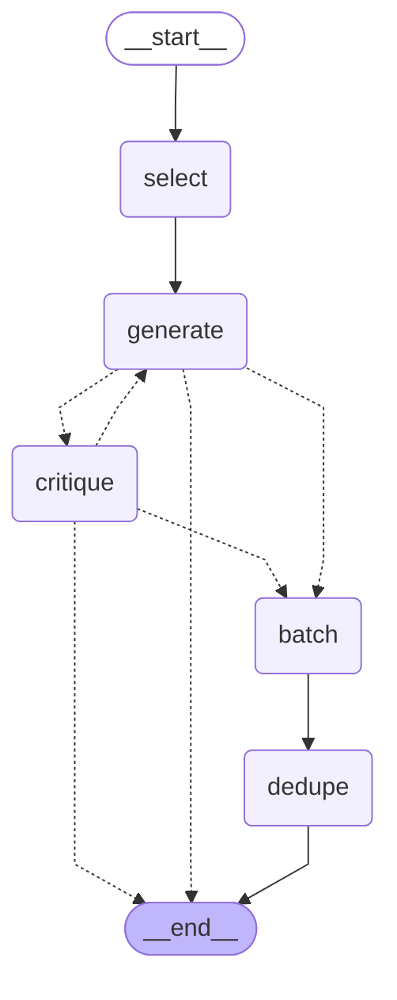

# ai/ — modi AI 서버 (FastAPI)

**투두 추천(S-16-B)** 을 담당한다. 아카이브 자동 태깅(S-25-C)은 Spring이 직접 처리하며
이 서버를 거치지 않는다([`docs/DECISIONS.md`](docs/DECISIONS.md) 확정, 2026-07-28).

```
투두 추천   앱(Flutter) → 서버(Spring) → AI 서버(FastAPI) → OpenAI
자동 태깅   앱(Flutter) → 서버(Spring) ───────────────────→ OpenAI
```

**앱은 이 서버를 직접 호출하지 않는다.** Spring의 HTTP 요청만 받아 JSON을 돌려주며,
원본 데이터(자료·폴더·태그·투두·방)의 주인은 Spring + PostgreSQL이다.

> 규칙·아키텍처의 단일 진실은 저장소 루트 [`CLAUDE.md`](../CLAUDE.md)와 [`specs/`](../specs)에 있다.

## 추천 파이프라인

`src/modi_ai/suggest.py`의 `SUGGEST_GRAPH`(LangGraph). **아래 그림은 손으로 그린 것이 아니라
`SUGGEST_GRAPH.get_graph().draw_mermaid()` 출력을 한 글자도 안 고치고 붙인 것이다** — 코드를
고쳤으면 다시 뽑아 통째로 갈아 끼운다(손질하면 다음 사람이 같은 손질을 반복하게 된다).
노드·엣지 모양은 `tests/test_suggest_graph.py::TestGraphShape`가 따로 못 박는다.



| 노드 | 하는 일 | 외부 호출 |
|---|---|---|
| `select` | 자료를 네 축(좋아요·핀·유사도·최근성)으로 줄 세우고 예산 초과분을 버린다 | 임베딩 1회(방 목표) |
| `generate` | 후보 생성 + 문자열 필터 | **LLM 1회** |
| `critique` | 바로 실행할 수 없는 후보를 반려한다 | **LLM 1회**(제목만) |
| `batch` | `dedupe` 가 쓸 임베딩을 묶는다(지연 호출) | 없음 |
| `dedupe` | 이미 노출한 후보와 **의미가** 겹치는 것을 버린다 | 임베딩 1회(배치) |

점선이 조건부 엣지다.
- `generate` 뒤 — 후보가 하나도 없으면 남은 노드를 건너뛴다.
- `critique` 뒤 — 통과분이 있으면 진행, 하나도 없으면 **빈 목록으로 끝낸다**(2026-08-03
  사용자 확정 — 나쁜 후보를 보여주느니 안 보여준다).

⚠️ **`critique → generate`(되돌아가기)는 운영에서 안 탄다.** 껐다 — 그것도 **두 번**.

1. `critique_max_attempts`가 2 이상일 때만 발동하는데 기본값이 **1**이다. 0/1/2를 나란히
   재고 정했다([`docs/EXPERIMENTS.md` #28](docs/EXPERIMENTS.md)).
2. 그 엣지가 "전부 반려"에만 걸려 사실상 안 타길래, **부분 반려에도 타게** 만들어 다시 쟀다
   (`regenerate_on_partial_reject`). 후보는 회복됐지만 **지연 상한 10초를 37%·40% 깨서
   기각**했다([#29](docs/EXPERIMENTS.md)). 기본값 **False**.

코드를 둘 다 남기는 이유는 설정 하나로 다시 재볼 수 있어야 하기 때문이다.

✅ **그 fail-open 은 고쳤다** — 원인은 후보 번호를 `0` 부터 매긴 것이었다.
검수만 떼어 60회를 재보니 `0` 이면 30회 중 **10회(33%)**가 판정을 하나 빠뜨렸고 `1` 이면
**30/30** 이 맞았다([#30](docs/EXPERIMENTS.md), `evals/probe_critique.py`). 고친 것은
`suggest.CRITIQUE_INDEX_BASE = 1` 한 줄이고 **프롬프트·스키마 설명은 안 건드렸다.**
방 평가 2회에서 fail-open **0/30 · 0/30**.

⚠️ **"검수가 살아나서 품질이 좋아졌다"고 쓰지 말 것** — 방마다 기준선보다 나쁜 실행이 하나씩
있어 실측은 "구분되지 않는다"까지다. 그리고 **왜 0-based 일 때만 이러는지는 모른다** —
증상을 없앤 것이지 기전을 안 것이 아니다. 모델을 바꾸면 재발할 수 있고, 알아채는 수단은 러너
계수기(`RoundResult.critique_failed_open`)뿐이다.

⚠️ **그래서 LangGraph 는 이 티켓 뒤에도 기능 이득이 없다.** 검수 노드도 `critique → END`
분기도 상태 전달도 전부 직선 코드로 된다. 그래프여야만 하는 것은 되돌아가는 루프(안 씀)와
Studio 시각화(개발 도구)뿐이다 — 품질을 올린 것은 **검수라는 아이디어**이지 그래프가 아니다
([`docs/EXPERIMENTS.md` #28 ④-1](docs/EXPERIMENTS.md)).

폴백 둘(임베딩 장애)과 검수 실패는 엣지가 아니라 `try/except`인데, **성공·실패가 같은
다음 노드로 가기 때문**이다.

> **⚠️ 임베딩 왕복이 2회다.** 목표 벡터는 LLM **전에** 필요하고 후보 제목 배치는 LLM **후에**만
> 만들 수 있어 합칠 수 없다.
>
> **⚠️ 최악치로는 이미 Spring 예산을 넘는다.** `get_llm()` 이 `timeout=120, max_retries=1` 이라
> LLM 단독 최악이 **240초**이고, 여기에 목표 임베딩 20초 + 배치 임베딩 40초를 더해 **합계 300초**다.
> Spring 의 read timeout 은 **60초**다(`AiServerConfig`). 게이트웨이가 죽지 않고 **느리기만 하면**
> 폴백이 발동하지 않아 사용자는 후보 대신 "AI 추천 서버에 연결하지 못했어요"를 본다.
> 실측 평균은 3.6~5.6초라 지금 문제가 되지는 않지만, **"60초 안에 들어온다"고 말할 수 있는 상태가
> 아니다.** 자세한 것과 처방은 `suggest.py` 의 `_select_archive` docstring 에 있다.
>
> *(2026-08-03 정정: 원래 "최악 40초 + LLM 8~11초 = 60초 안, 여유 9초"라고 적혀 있었다 —
> LLM **타임아웃** 자리에 **실측치**를 넣은 오류였다. 에서 코드 주석만 고치고
> 이 문서를 빠뜨렸다.)*

## 사전 준비

| 도구 | 버전 | 확인 |
|---|---|---|
| uv | 0.11+ | `uv --version` |
| Python | 3.12 (`.python-version`) | uv가 자동 설치 |

Python은 따로 설치하지 않아도 된다 — `uv sync`가 `.python-version`을 보고 알아서 받아온다.

## 실행

```bash
cd ai
uv sync                                        # 가상환경 생성 + 의존성 설치
uv run uvicorn modi_ai.main:app --reload --port 8000
```

- 헬스체크: `GET http://localhost:8000/v1/health` → `{"status":"ok"}`
- API 문서(Swagger UI): `http://localhost:8000/docs`

`--reload`는 개발용이다. 파일을 고치면 서버가 자동으로 재시작된다.

## 테스트 · 린트

```bash
uv run pytest          # 테스트
uv run ruff check .    # 린트
uv run ruff format .   # 포맷
```

## LangGraph Studio — 그래프를 눈으로 보기 (개발 전용)

```bash
PYTHONUTF8=1 uv run --group studio langgraph dev
```

브라우저에서 <https://smith.langchain.com/studio/?baseUrl=http://127.0.0.1:2024> · 그래프 이름
`todo-suggestions`. 노드가 하나씩 흐르는 것과 어떤 후보가 왜 반려됐는지가 보인다.

- ⚠️ **`PYTHONUTF8=1`이 없으면 안 뜬다.** cp949 윈도우에서 세 군데가 각각
  `UnicodeDecodeError`로 죽는다 — `langgraph.json` · `.env` · **`langgraph_api`가 자기
  패키지에 번들한 `openapi.json`**(라이브러리 쪽 문제라 우리가 못 고친다).
- ⚠️ **실제 LLM을 호출한다(크레딧).** `LANGSMITH_TRACING`이 켜져 있으면 자료 본문이
  LangSmith로 올라간다 — 운영에서는 둘 다 금지다(`ai/CLAUDE.md`).
- Studio가 보는 그래프는 운영 `SUGGEST_GRAPH`가 아니라 **`prepare` 노드를 앞에 붙인 사본**이다
  (`llm`/`embed`를 JSON으로 못 넣기 때문). 나머지 배선은 같은 함수를 재사용하고, 그 동일성은
  `tests/test_studio_graph.py`가 지킨다.
- 의존성이 34개 늘어 `dev`가 아니라 **별도 `studio` 그룹**이다. CI와 운영 이미지에는 안 들어간다.

## 평가 하네스 (`evals/`)

**실제 LLM을 호출해 크레딧을 쓴다** — CI에서 돌지 않는다(`pyproject.toml`의 `testpaths` 밖).

**러너가 둘이다 — 재는 질문이 다르다.**

| | `run_suggest_eval` | `run_room_eval` |
|---|---|---|
| 단위 | 자료 1건 독립 호출 | **방 전체 한꺼번에**(캡처한 운영 요청) |
| 답하는 질문 | 이 자료가 어떤 후보를 낳나(귀속) | 사용자가 버튼을 누르면 무엇을 보나 |
| 파이프라인 | LLM 호출만 | **운영 `suggest()` 그래프 전부** |
| 실행 | 1회 | **반복 → 평균 ± 표준편차** |

```bash
uv run python -m evals.summarize_fixtures            # 선행: 픽스처 요약 동결 (호출 15회, 1회만)
uv run python -m evals.run_room_eval                 # 2방 × 3라운드 × 5반복 (호출 30회)
uv run python -m evals.run_room_eval --rooms busan_travel --repeats 1  # 크레딧 아끼며 확인
uv run python -m evals.run_room_eval --start-excluded captured         # 캡처 당시 제외 목록에서 시작
uv run python -m evals.run_suggest_eval              # 자료 15건 (호출 15회)
uv run python -m evals.run_suggest_eval --limit 3    # 크레딧 아끼며 확인
uv run python -m evals.run_suggest_eval --input body                  # #13 기준선 재현
uv run python -m evals.calibrate_dedupe               # 의미 중복 임계값 캘리브레이션 (호출 1회)
uv run python -m evals.freeze_snapshot --list                          # 크레딧 0 — 결과 동결
uv run python -m evals.freeze_snapshot --all --date 2026-08-01
```

> **EXPERIMENTS 에 적는 숫자는 커밋된 스냅샷에서 나와야 한다.** 러너 출력
> `data/suggest_eval_export.json` 은 `.gitignore` 라 나중에 확인할 방법이 없다 —
> 문서와 파일이 어긋난 사고가 실제로 있었다([#13](docs/EXPERIMENTS.md)). `freeze_snapshot` 이 그 다리다.
> 같은 조건을 반복 실행할 때는 **`--label` 을 붙여라** — 안 붙이면 앞 실행을 덮어쓴다.

### 입력은 **요약**이다 (2026-08-01)

운영에서 추천 프롬프트에 들어가는 자료 텍스트는 요약이다(`V5`). 러너도 같은 조건을
쓰도록 `data/summaries/`에 **Spring과 같은 프롬프트·같은 모델로 만든 요약을 동결해 커밋**해뒀다.
`--input body`는 [#13](docs/EXPERIMENTS.md) 기준선을 재현할 때만 쓴다.

- 요약 프롬프트의 진실은 **Spring**(`OpenAiSummaryClient.SYSTEM_PROMPT`)이고 Python 쪽은 복제본이다.
  어긋나면 `tests/test_summary_prompt_drift.py`가 죽는다 — 틀려도 요약은 그럴듯하게 나오므로
  다른 데서는 안 걸린다.
- 요약 파일을 다시 만들면(`--force`) **그 전 실행과 비교가 성립하지 않는다.**

### ⚠️ A/B 플래그는 **같은 지시가 다른 곳에도 있는지** 먼저 확인할 것

### 카테고리는 **AI가 정하지 않는다** (2026-08-04)

추천 후보는 카테고리 없이 나가고(= 기타/미분류) 사용자가 투두 탭에서 직접 분류한다.

그 전에 세 가지를 만들어보고 **셋 다 실패했다** — 프롬프트로 시키기(#21), 임베딩 코사인으로
접기(실사용 10/10 실패), LLM 별도 호출로 배정하기(#31, 후보당 종수가 0.81 → 0.96으로 악화).
되살리기 전에 [`docs/RESTORE-category-assignment.md`](docs/RESTORE-category-assignment.md)를
먼저 읽을 것 — 그냥 되돌리면 실패한 상태로 돌아간다.

그래서 러너에서도 규칙4·스키마힌트·카테고리 축이 함께 사라졌다.

### ⚠️ 지금은 자동 채점을 하지 않는다

프로토타입(공용 GPU 서버 + Qwen)에서 채점기를 이식해 지표 셋을 먼저 만들었는데,
**실측 끝에 셋 다 무효로 판명돼 전부 지웠다.** 상세와 되살리기 전 읽을 것은
[`docs/EXPERIMENTS.md`](docs/EXPERIMENTS.md) "다시 하지 말 것".

**교훈: 지표를 먼저 만들고 데이터를 맞추지 않는다.** 출력을 눈으로 보고 무엇이 실제로 문제인지
찾은 뒤에 지표를 정의한다.

그래서 러너가 주는 것은 이것뿐이다.

| 출력 | 용도 |
|---|---|
| **후보 전문** | 눈으로 본다. 지금 이게 제일 중요하다 |
| 토큰량·응답 시간 | 비용·속도 관측 |
| 필터 탈락 수 | `source_item_id` 위반·중복으로 걸러진 개수(`suggest.filter_candidates`) |
| 제목 길이 분포 | 관측만. **합격선이 아니다** — 8회 실행에서 20자 초과 비율이 58.3~74.2%로 흩어진다 |

> ⚠️ **후보 개수와 제목 길이 분포는 조건 비교의 근거로 쓸 수 없다.** temperature 0.0인데도 같은
> 조건 재실행에서 후보가 31 ↔ 35, 28 ↔ 25로 갈렸다([#20](docs/EXPERIMENTS.md)). 델타를 결론으로
> 쓰기 전에 **같은 설정을 두 번 돌려 잡음 범위를 먼저 재라** — 반복 실행에는 `--label` 을 붙여야
> 앞 실행을 안 덮어쓴다.

- `evals/data/archives/*.txt` — 실제 인스타/블로그 캡션 15개. **정답 라벨은 없다.**
- `evals/data/summaries/*.txt` — 위 캡션의 요약(동결·커밋). 조건 간 비교가 성립하려면 고정돼야 한다.
- `evals/data/rooms/*.json` — **Spring이 AI 서버로 실제 보낸 요청**을 캡처 프록시로 받아 적어
  얼린 것(부산 여행 10건 · 회화 스터디 21건). SQL로 다시 뽑지 않은 이유는
  `pickContent`(요약·본문 중 짧은 쪽)와 조인을 재구현하면 **그게 어긋나는 순간 측정 전체가
  조용히 틀어지기** 때문이다. 스냅샷과 같은 취급 — **손으로 고치지 않는다.**
  다시 뜨려면 AI 서버를 8001로 옮기고 8000에 캡처 프록시를 띄운 뒤 앱에서 추천을 한 번 누른다.
  ⚠️ Spring `RestClient`는 **chunked**로 보낸다 — `Content-Length`만 읽으면 본문이 0바이트다.
  **자주 다시 뜨지 않는다.** 파일의 99%가 임베딩이라 갱신할 때마다 압축 약 270KB가 히스토리에
  영구히 쌓이고, 무엇보다 **기준선과 비교가 끊긴다**(`docs/EXPERIMENTS.md` #26 수치는 특정
  픽스처에 대한 것이다 — 해시로 묶여 있고 `tests/test_room_runner.py`가 지킨다).
  새 방을 추가할 때만 늘리고, 기존 방은 내용이 크게 바뀐 경우에만 다시 뜬다.
- `evals/data/snapshots/` — 특정 시점 모델 출력을 동결해둔 것. 지표를 새로 정의했을 때
  "그때 모델이 뭘 냈는가"를 크레딧 0으로 다시 채점하기 위한 것이다. **손으로 고치지 않는다.**
- 러너 출력(`suggest_eval_export.json`·`room_eval_export.json`)은 **커밋하지 않는다**(실행마다 덮어써진다).
  남길 값은 `freeze_snapshot`으로 동결한 뒤 `docs/EXPERIMENTS.md`에 조건과 함께 적는다.
- 자료가 인스타 캡션이라 실사용 워크로드(자료당 약 6.8k tok)보다 훨씬 짧다.
  **여기 나온 토큰 수를 비용 추정에 쓰지 말 것.**

## 로컬 전용 파일

`.env.example`을 `.env`로 복사한 뒤 값을 채운다. `.env`는 커밋되지 않는다.

```bash
cp .env.example .env
```

발급 방법과 각 키의 용도는 저장소 루트 [`README.md`](../README.md)의 "로컬 전용 파일" 절 참고.

## 구조

```
ai/
├── Dockerfile            운영 이미지 (uv sync --frozen --no-dev — dev 의존성 제외)
├── pyproject.toml        의존성 · ruff · pytest 설정
├── .python-version       Python 3.12 고정
├── .env.example          키 이름만 (값 없음)
├── src/modi_ai/          런타임
│   ├── config.py         환경 설정
│   ├── tracing.py        LangSmith 배선 (.env 값을 os.environ으로)
│   ├── prompts.py        프롬프트 원본 — git이 유일한 진실
│   ├── schemas.py        요청·응답 모델
│   ├── suggest.py        후보 생성 LangGraph — select→generate→critique→batch→dedupe (위 그림).
│   │                     순수 함수(build_payload·filter_candidates·drop_semantic_duplicates·
│   │                     drop_semantic_duplicates)는 노드 밖에 있어 크레딧 0으로 테스트된다
│   ├── ranking.py        자료 순위 — 가중 순위 정규화. LLM도 네트워크도 없는 순수 계산
│   ├── embeddings.py     임베딩 클라이언트 — 후보 의미 중복 판정 + 자료 순위 + 방 목표
│   ├── security.py       X-Internal-Key 검증
│   └── main.py           FastAPI 앱 + /v1/health + /v1/todo-suggestions
├── evals/                평가 하네스 — **런타임 아님**, 크레딧을 쓴다
│   ├── dataset.py        자료 로더 + 동결 스냅샷 로더
│   ├── summarize_fixtures.py  픽스처 요약 동결 (Spring 프롬프트 복제 — 드리프트는 테스트가 잡는다)
│   ├── freeze_snapshot.py     러너 결과 → 커밋되는 동결 스냅샷 (크레딧 0)
│   ├── run_suggest_eval.py
│   ├── calibrate_dedupe.py         의미 중복 임계값 근거 (실측 후보 24개 픽스처 포함)
│   └── data/             자료 15개 + 스냅샷 (정답 라벨 없음)
└── tests/                크레딧 0 · 결정론적
```

## 참고

- 생성 모델은 **`gpt-5.4-nano`**다(2026-07-30, `gpt-4.1-mini`에서 교체). ⚠️ **사전 실측 없이 정해진 값이다** —
  근거는 사후에 찾기로 했고 세 축이 모두 사후에 뒷받침됐다(`docs/DECISIONS.md`): 원문 충실도는 고유명사가
  많은 6건을 눈으로 대조해 손상 0([#20 ④](docs/EXPERIMENTS.md)), 비용은 운영 모양 추천 1회 **약 $0.0009**
  (LangSmith 추정 — **게이트웨이 크레딧과 같지 않다**, [#7](docs/EXPERIMENTS.md)).
  기본값이 네 곳(`config.py`·`ai/.env.example`·`deploy/.env.example`·`deploy/docker-compose.app.yml`)에
  있고 **각자의 `ai/.env`가 코드 기본값을 이긴다** — 모델을 바꿨는데 안 바뀌면 거기를 먼저 본다.
  ~~참고로 **Spring이 담당하는 태깅은 `gpt-5-nano` 유지**로 확정됐다~~ → **2026-08-13: 태깅도 이 모델로
  합쳐서 세 기능이 같은 값을 쓴다.** 게이트웨이 키 회수로 제공사가 OpenAI 직접이 되면서 태깅을 따로 두던 유일한
  근거(크레딧 등급)가 사라졌다 — 태깅 워크로드 실측은 [#34](docs/EXPERIMENTS.md).
  ⚠️ 위 **$0.0009 는 게이트웨이 시절 LangSmith 추정치**다. 직접 과금에서는 숨은 추론 토큰까지 출력 토큰으로
  청구되므로 추론 모델을 쓸 때의 비용 비교가 그 시절과 다르다.
- 임베딩은 `text-embedding-3-small`(1536차원). **이 서버는 아무것도 저장하지 않는다** — 요청 시점에 만들어
  쓰고 버린다. 쓰는 곳은 둘이다: 후보 의미 중복 판정과 **방 목표 ↔ 자료 유사도**
 .
  자료 임베딩은 **Spring이 등록 시점에 만들어 `archive_items.embedding`(`real[]`, `V7`)에 저장하고**
  추천 요청에 벡터째로 실어 보낸다(자료 18건에 약 390KB — 내부망 1회라 수용).
  ~~pgvector~~ 대신 `real[]`로 확정 — 선별을 이 서버가 메모리에서 하므로 Postgres는 벡터로 검색하지
  않는다(`docs/DECISIONS.md`).
  ⚠️ 양쪽 모델이 **같아야 한다** — 여기 `OPENAI_EMBEDDING_MODEL`, Spring `ARCHIVE_EMBEDDING_MODEL`.
  다른 모델로 만든 벡터끼리는 코사인 유사도가 의미를 갖지 않는다.
- LangSmith 추적은 **개발 환경에서만** 켠다. 운영에서 켜면 사용자 자료 본문이 외부로 나간다.
