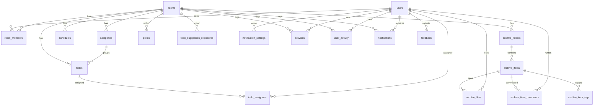

# 0002 — 데이터 모델 (PostgreSQL)

> 방장 개념 없음: 방 멤버는 모두 동일 권한. 진행률은 저장하지 않고 계산(또는 캐시).

## 엔티티

### users
- `id` (VARCHAR, = Firebase Auth UID), `nickname`, `profile_image` (nullable), `fcm_token` (nullable), `created_at`, `login_provider` (nullable, `KAKAO`/`GOOGLE`/`APPLE`/`EMAIL`), `email` (nullable, `V29__add_email_to_users.sql`, 2026-08-12)
- 자체가입: **아이디를 이메일로 사용**(Firebase email/password) — 이 계약 자체는 안 바뀐다(로그인은 여전히 이메일/비번). 다만 아래 `email` 컬럼이 새로 생겼다.
- **`email`(2026-08-12 확정, `specs/0001-architecture.md` 인증 흐름 6번 참고)**: `login_provider`와 달리 값이 오고 기존과 다르면 **매번** 갱신한다. Google/Apple/이메일 자체가입은 Firebase ID 토큰의 이메일 클레임에서, Kakao는 Kakao 사용자 API(`kakao_account.email`, 동의항목 필요)에서 채운다. **순수 정보성 컬럼**(CS/관리자 조회용)이며 중복가입 판정·계정 병합에는 쓰지 않는다 — 그 판정은 여전히 Firebase Admin SDK(`FirebaseEmailAvailabilityChecker`) 기준(`specs/OPEN.md` 참고). UNIQUE 제약 없음(여러 provider로 가입한 동일인이 같은 이메일 값을 가질 수 있음). 백필 배치 없음 — 이 컬럼이 생기기 전 유저는 다음 로그인(Google/Apple/이메일은 사실상 다음 앱 실행, Kakao는 동의항목이 켜져 있어야) 때 자연히 채워진다.
- **`login_provider`(마이 탭 계정 배지, `V22__add_login_provider_to_users.sql`, 2026-08-07)**: 최초 가입 시점에만 기록하고 재로그인으로 덮어쓰지 않는다. 카카오는 `UserService.ensureSocialUser`(Firebase Custom Token 발급 전이라 provider가 코드상 명확)에서 직접 고정하고, 구글/이메일은 Firebase ID 토큰의 `firebase.sign_in_provider` 클레임(`"google.com"`/`"password"`)을 매핑한다(애플은 미구현). **과거 유저 백필은 카카오만 가능** — `users.id`가 `"kakao:"` 접두사라 확정 가능하지만, 구글/이메일은 Firebase 발급 uid 형태가 provider와 무관하게 동일해 과거 유저는 구분 불가(`null`로 남고 프론트가 "연결됨"으로 폴백).
- `fcm_token`: FCM 푸시(콕찌르기 등) 발송용 디바이스 토큰. `PUT /me/fcm-token`으로 등록(`V4__add_fcm_token_to_users.sql`, 2026-07-29). 디바이스 1대만 지원(멀티 디바이스 미지원 — 최신 등록값으로 덮어씀).
- **회원 탈퇴 시 `users` 행 삭제(`V9__account_deletion_cascades.sql`, 2026-08-03 확정)** — `users.id`를 참조하는 FK는 삭제 전까지 전부 `ON DELETE` 절이 없어(기본 `NO ACTION`) 삭제 자체가 막혔다. 이번 마이그레이션으로: `room_members`는 그대로 두고(탈퇴 로직이 삭제 전에 모든 방을 먼저 나가게 하므로, 구멍이 있으면 여기서 FK 위반으로 시끄럽게 실패하는 편이 유령 멤버십보다 낫다), `todo_assignees`/`archive_likes`/`pokes.from_user`/`pokes.to_user`/`notification_settings`는 `ON DELETE CASCADE`(공유 콘텐츠가 아니라 순수 개인 활동 기록이라 함께 삭제), `archive_items.created_by`만 `ON DELETE SET NULL`(다른 멤버와 공유하는 콘텐츠라 자료는 남기고 작성자만 지움 — 아래 `archive_items` 참고). 상세는 `specs/0012-설정.md` 회원 탈퇴 절.

### rooms
- `id`, `name`, `cover_image` (nullable), `goal`, `goal_detail` (nullable)
- `start_date`, `end_date`, `status` (`ACTIVE` | `ENDED`), `created_at`
- 상태 전이: `end_date` 경과 시 `ENDED` **자동 전환**(4-3). 재시작(S-12) 시 기간 수정 후 `ACTIVE` 복귀.

### room_members  (N:M users↔rooms)
- `room_id`, `user_id`, `joined_at` · PK(room_id, user_id)
- 마지막 멤버가 나가면 방 삭제(S-40-C).

### invite_codes → **Redis 단독 저장** (Postgres 테이블 아님, 2026-07-23 확정)
- Postgres 테이블로 만들지 않는다. Redis에 `room_id ↔ code` 매핑만 TTL 1일로 저장, 이력(발급일시·과거 코드)은 남기지 않는다.
- 코드: 6자, 혼동 문자(`0`/`O`, `1`/`I`) 제외한 대문자+숫자 32자 알파벳에서 랜덤 생성.
- 키 설계(구현 참고): `invite:code:{CODE}` → `roomId` (TTL 86400s), `invite:room:{roomId}` → `CODE` (역방향 조회용, 동일 TTL). 재발급(S-40-B) 시 `invite:room:{roomId}`의 이전 값으로 `invite:code:{oldCode}`를 삭제하고 둘 다 새 값으로 갱신 — 이전 코드는 즉시 무효화됨.
- 유일성은 **활성 키끼리만** 보장(TTL로 이미 죽은 문자열과 우연히 겹쳐도 무방) — 생성 시 `SETNX` 실패하면 재시도.
- 구현 시 유의: P2에서 만들어진 `invite_codes` Postgres 테이블/`InviteCode` 엔티티는 이 결정으로 불필요해졌다 — 실제 제거(V1 파일은 손대지 않고 새 V2 마이그레이션으로 DROP + 엔티티 삭제)는 별도 구현 작업으로 진행한다(`specs/OPEN.md` 참고).

### 이메일 인증코드 → **Redis 단독 저장** (같은 이유, 2026-07-31 확정)
- `invite_codes`와 동일한 논리 — TTL 5분짜리 6자리 코드에 이력을 남길 이유가 없어 Postgres 테이블을 만들지 않는다.
- 키: `email:verify:code:{email}`(코드, TTL 5분) · `email:verify:attempts:{email}`(실패 횟수, TTL 5분) · `email:verify:cooldown:{email}`(재전송 쿨다운 마커, TTL 60초). `email`은 소문자 정규화 후 키에 쓴다.

### categories  (방 내 그룹, 마감·담당자 없음)
- `id`, `room_id`, `name`, `position`(수동 순서변경용 INT, 2026-08-03 — `PATCH /rooms/{roomId}/categories/order`로 갱신, `UNIQUE` 제약 없음), `created_at`

### todos
- `id`, `room_id`, `category_id` (nullable → null=독립 ToDo; **UI 표기는 "기타"**, 2026-08-03 ), `title`, `detail` (nullable)
- `due_date` (DATE, nullable) (`V16`) — 협업 캐릭터(`specs/0016`)가 마감 준수율 계산에 쓰기 때문에 존치했다.
- `completed` (bool), `completed_at` (nullable), `position` (INT, `V12` 2026-08-04 사용자 요청 — 드래그 순서변경), `created_at`
- `image_url` (VARCHAR(1024), nullable) — 첨부 사진(투두 1개당 1장). `V16`에서 만들어졌으나 2026-08-07 롤백으로 매핑을 걷어냈던 컬럼을 2026-08-09 다시 살렸다(투두 사진 첨부 → 모아보기 "이미지" 탭, `docs/backend/todo-image-archive-handoff.md`). `image_pinned` (bool, `V25`), `image_attached_at` (TIMESTAMPTZ, nullable, `V25`) — "이미지" 탭 정렬 기준(핀 우선 → 이 값 최신순). `GET /rooms/{roomId}/archive/todo-images`가 방 전체(폴더 무관)를 이 순서로 반환하고, 대표 담당자는 `todo_assignees`에서 `user_id` 오름차순 첫 번째를 고른다.
- `important` (BOOLEAN NOT NULL DEFAULT FALSE, `V26`, 2026-08-09) — 중요 표시. `V16`의 `flagged`(옛 인라인 작성기 전용, 여전히 죽은 채)와는 별개의 새 컬럼이다. 정렬·필터엔 아직 반영되지 않는다(`docs/backend/todo-form-handoff.md` — 저장·반환까지만 요청됨).
- `created_by` (VARCHAR, nullable, `V19__add_created_by_to_todos_and_schedules.sql`, 2026-08-06) — 홈 활동 피드 `TODO_ADDED` 이벤트의 actor용. 투두는 방 전체가 보는 공유 콘텐츠라 작성자가 탈퇴해도 투두는 남고 작성자만 `ON DELETE SET NULL`(`archive_items.created_by`와 같은 근거). 기존 행은 `NULL`(백필 안 함, 과거분은 작성자 미표시).
- **2026-08-06 사용자 요청으로 “투두 마감 없음” 결정을 대체했다.** `due_date`는 입력·저장·표시용 메타데이터이며 등록/수동 정렬을 바꾸지 않고, 날짜 기반 푸시도 아직 없다.
- **2026-08-07 롤백 — 매핑하지 않는 컬럼**: `location` (VARCHAR(200)), `flagged` (BOOLEAN, default false), `image_url` (VARCHAR(1024))는 `V16`으로 만들어져 **DB에 남아 있지만 JPA 엔티티(`Todo`)에 매핑하지 않고 API도 읽거나 쓰지 않는다.** 인라인 작성기를 걷어내며 함께 제거했으나 Flyway 과거 파일을 되돌리지 않는다는 규칙과, 08-06 이후 저장된 값 보존 때문에 DROP 하지 않았다(`ddl-auto: validate`는 엔티티→DB 단방향이라 무해). `flagged`는 `NOT NULL DEFAULT FALSE`라 엔티티가 안 채워도 INSERT가 통과한다. 정리 여부는 `specs/OPEN.md` 후속.
- `position`은 `(room_id, category_id)` 단위로 스코프된다(카테고리별로 독립된 숫자축, "기타"도 하나의 그룹). 드래그로 옮길 수 있는 건 **나에게 배정된 투두뿐**이다("내 투두만" 화면이 미지정 투두를 안 보여주므로, FR-39의 "미지정은 누구나" 예외는 여기 두지 않는다 — 2026-08-04 리뷰로 발견한 불일치를 정정). `PATCH /rooms/{roomId}/todos/order`(body: `categoryId`, `todoIds`)가 내 투두들이 지금 차지한 자리에만 새 순서를 끼워 넣고, 남의 투두는 자리(position 값)까지 그대로 둔다 — `UNIQUE` 제약 없음(categories.position과 동일 이유).
- 2026-07-27의 “날짜 컬럼을 추가하지 않는다” 해석은 위 2026-08-06 사용자 요청으로 폐기됐다. `PUT`은 **전체 교체**라 `dueDate`를 생략한 수정 요청은 마감일을 지운다(`reminder` 중첩 객체와 그 "생략하면 보존" 규칙은 2026-08-07 롤백으로 사라졌다).

### todo_assignees  (N:M todos↔users, 담당자 복수)
- `todo_id`, `user_id` · PK(todo_id, user_id)
- 미지정 = 행 없음 → 미지정 배너/처리(S-17). AI 추천 생성분은 미지정으로 시작.

### ~~todo_tags~~  (2026-08-07 롤백 — 테이블은 남고 매핑은 없음)
- `todo_id`, `tag` · PK(todo_id, tag). `V16`으로 만들어졌고 `todo_id`는 `ON DELETE CASCADE`다.
- **인라인 작성기와 함께 폐기됐다.** JPA 엔티티(`TodoTag`)·리포지터리·API가 모두 제거돼 **읽지도 쓰지도 않는다.** 위 `todos`의 미사용 컬럼과 같은 이유로 테이블만 남겨 뒀다(투두를 지우면 CASCADE로 함께 정리된다). ERD에서도 뺐다.

### todo_suggestion_exposures  (AI 추천 후보를 이미 보여줬다는 기록)
- `id`, `room_id`, `title`, `created_at` (`V6`, 2026-07-30 )
- **투두가 아니다.** 사용자에게 후보로 노출한 문자열일 뿐이고, 채택된 투두는 `todos`에 별도로 생긴다. 그래서 `todos`와 FK로 연결하지 않는다 — 후보 대부분은 투두가 되지 않는다.
- 용도는 하나: 다음 추천 요청의 `excluded_todos`(AI 서버 계약, `ai/src/modi_ai/schemas.py`)를 채워 **같은 후보가 다시 나오지 않게** 한다(`full_spec.md` §S-16-B "중복 후보 재노출 안 함"). 읽는 것이 제목뿐이라 `category`·`source_item_id`는 저장하지 않는다.
- **⚠️ "사용자가 거절한 후보"가 아니라 "이미 노출한 후보 전부"다.** 앱에 거절 버튼이 없으므로(원본에 없다) 채택하지 않고 시트를 닫은 후보도 전부 들어간다. 거절로 읽으면 `rejected` 플래그를 만들게 되는데 그것을 채울 사용자 입력 자체가 없다.
- **방 단위**(유저 단위 아님) — 방 멤버는 동일 권한이라 한 사람이 본 후보를 다른 멤버에게 다시 보여줄 이유가 없다.
- **상한 = 방별 최근 50개.** 오래된 행을 지우지 않고 **조회를 50개로 제한**해 지킨다 — 상한의 목적은 LLM 프롬프트 크기이기 때문이다. `UNIQUE(room_id, title)` 제약은 일부러 두지 않았다(동시 요청이 겹치면 INSERT가 터져 추천 자체가 실패한다 — 중복 행보다 나쁘다). 중복 제거는 서버 코드가 한다.
- 기록 시점은 후보를 **생성해 반환할 때**다. 대가로 사용자가 응답을 받기 전에 이탈하면 못 본 후보도 제외되지만, 50개가 롤오버되면서 되살아난다(`specs/0001-architecture.md` AI 기능 흐름 참고).

### schedules  (일정, 투두와 독립·팀 전체용)
- `id`, `room_id`, `title`, `date`, `time` (nullable), `end_date` (nullable), `end_time` (nullable,
  둘 다 `V11`, 2026-08-04 사용자 요청 — 이전 "시간은 단일 값 유지, end_time 없음" 방침(`V8`)을 뒤집었다),
  `detail` (nullable), `place` (VARCHAR(100), nullable, `V8`, 2026-08-03 , MR !52), `created_at`
  — 장소는 선택 입력이라 없는 일정이 정상이다. `end_date`는 여러 날에 걸치는 일정(다중일) 지원용, `date`와
  같으면 서버가 저장 시 `null`로 정규화한다(단일일 일정의 대표 표현을 하나로 고정). `end_time`은 `time`이
  있어야 설정 가능하고, 같은 날 안에서는 `time`보다 늦어야 한다(다중일이면 이 순서 제약 없음).
- 담당자 없음. 홈 주간 캘린더는 이 데이터만 연동(투두 연동 안 함) — 대시보드 `ScheduleBrief`는 2026-08-05부터
  `endDate`·`endTime`을 모두 내려준다(프론트가 `formatServerTimeKorean`으로 초를 제거해 표시).
- 조회(월간/주간)는 `date BETWEEN`이 아니라 **구간 겹침**(`date <= end AND coalesce(end_date, date) >= start`)
  기준으로 바뀌었다 — 다중일 일정이 조회 구간보다 먼저 시작해도 구간 안으로 걸치면 보여야 하기 때문.
- `created_by` (VARCHAR, nullable, `V19`, 2026-08-06) — 홈 활동 피드 `SCHEDULE_ADDED` 이벤트의 actor용. `todos.created_by`와 같은 규칙(`ON DELETE SET NULL`, 백필 안 함).

### archive_folders
- `id`, `room_id`, `name`, `created_at`
- 폴더 목록 응답의 대표 `thumbnail`(2026-08-03 , MR !55)은 **컬럼이 아니라 응답 집계 값**(폴더 내 대표/최신
  항목의 thumbnail) — `GET .../archive/folders` 응답에 nullable로 포함. 스키마 변경 아님, 선정 규칙은 아래 "계산값" 절 참고.
- **방마다 폴더 최소 1개 보장(2026-08-07 백엔드 요청, 컬럼/마이그레이션 없음 — 로직만)**: 방 생성 시 "기본" 폴더를 즉시 만들고,
  0개인 기존 방은 조회 시점에 만든다(`ArchiveFolderService`). 남은 폴더가 1개면 삭제를 막아 0개 상태 자체를 안 만든다.
  `specs/0010-아카이브-탭.md` 참고.

### archive_items
- `id`, `folder_id`, `room_id`, `title`, `url` (nullable), `body_text` (nullable), `source` (nullable)
- `thumbnail` (nullable), `pinned` (bool), `created_by` (user_id, **nullable**, `V9` 2026-08-03 — 작성자가 탈퇴하면 `SET NULL`, 자료 자체는 방에 남는다), `created_at`
- `image_url VARCHAR(2048)` (nullable) — 폴더 직접 업로드 이미지 자료(`V28`, 2026-08-09 후속 확정,
  `docs/backend/archive-image-upload-handoff.md`). `url`(링크)·`body_text`(텍스트)와 같은 관례로
  종류를 구분한다 — 별도 종류 컬럼 없이 `url`/`body_text`/`image_url` 중 **정확히 하나만** 채워진다.
  이미지 자료는 크롤링·AI 태깅/요약/임베딩 대상이 아니라 등록 즉시 `crawl_status='DONE'`이다.
  투두 첨부 이미지(`todos.image_url`, `V25`, 방 전체 피드)와는 별개 경로 — 이쪽은 폴더 스코프다.
- `memo VARCHAR(500)` (nullable) — 사용자 메모(**구현 완료**, 2026-08-06, `V18__add_memo_to_archive_items.sql`). 상세 응답(`ArchiveItemDetailResponse.memo`)에 포함, S-25-C 등록 시트(링크 모드) 입력 + S-25-B "⋯" 메뉴 편집(`PATCH .../items/{itemId}/memo`) 모두 구현. 상세는 `specs/0010-아카이브-탭.md`.
- `crawl_status` (`PENDING` | `DONE` | `FAILED`, 기본 `DONE`) — S-25-D 외부 공유(URL) 등록은 크롤링이 끝날 때까지
  `PENDING`으로 남고 그동안 `body_text`가 `NULL`이다. 텍스트 공유·인앱 등록(S-25-C)은 크롤링이 필요 없어 항상 즉시 `DONE`.
  `FAILED`는 크롤링 실패 후 상태(삭제만 가능, 재시도 UI는 범위 밖 — `specs/0014` 참고).
  - ⚠️ **2026-08-06부터 텍스트 등록은 `PENDING` 을 거치지 않는다** — 본문이 등록 시점에 이미 완성이라 곧바로 `DONE` 이다(`ArchiveItem.textDone`).
    태깅·임베딩은 뒤에서 돌지만 파생 데이터라 상태를 좌우하지 않는다. 상세는 `specs/0014`.
  - ⚠️ **2026-08-06부터 `PENDING`은 "자동 재시도 대기 중"도 뜻한다**(`V15`). 다시 해볼 만한 실패(상대의 일시적 상태 —
    인스타 소프트 블록, 연결·읽기 타임아웃)는 `FAILED`로 굳히지 않고 `PENDING`을 유지한 채 `next_crawl_at`만 찍는다.
    앱은 그대로 "분석 중"을 그린다(`CrawlStatusBadge`) — 앱 계약은 바뀌지 않았다.
- `crawl_retries` (INT NOT NULL, 기본 0) · `next_crawl_at` (TIMESTAMPTZ, nullable) — 크롤링 자동 재시도(`V15`, 2026-08-06).
  **왜 있나**: 운영 서버의 데이터센터 IP가 인스타에서 소프트 블록되는데 그 차단은 10~20분이면 풀린다(운영 DB 실측: 12:45 실패 → 12:54 성공,
  15:18 실패 → 15:36 성공). 그 순간 들어온 공유가 영구 `FAILED`로 확정되던 것이 실패율 58%(인스타 19건 중 11건)의 실체다.
  - **총 시도 횟수 = 1 + `crawl_retries`.** 상한은 재시도 3회라 최악 60분 안에 `DONE` 또는 `FAILED`로 확정된다 —
    "분석 중"이 영원히 남지 않게 하는 것이 상한의 목적이다. 성공해도 초기화하지 않는다(몇 번 만에 됐는지 남긴다).
  - **`next_crawl_at`이 `NULL`인 경우가 셋** — ① 재시도 대상이 아닌 항목(`V15` 이전 등록분 포함)
    ② 배치가 방금 집어간 항목(재선점 방지로 비운다) ③ 이미 `DONE`/`FAILED`로 끝난 항목.
  - 집어가는 쪽은 `ArchiveCrawlRetryScheduler`(5분마다, 한 tick 최대 20건). 상한이 없으면 차단이 길었던 뒤 밀린 항목이
    한꺼번에 나가 방금 풀린 차단을 다시 부른다. 부분 인덱스 `idx_archive_items_next_crawl_at`이 그 조회를 받는다.
- `summary` (VARCHAR(500), nullable) — 본문의 AI 요약(`V5`, 2026-07-30 ). 목적은 화면 표시가 아니라
  **투두 추천(S-16-B)의 프롬프트 비용 절감**이다(자료 20건 기준 약 117,000 tok → 약 2,600 tok, `ai/docs/EXPERIMENTS.md` #8).
  S-25-B에서는 본문 위에 함께 보여준다(`specs/0010`). **`NULL`이 정상인 경우가 셋** — ① `V5` 이전 등록분(백필하지 않음)
  ② `crawl_status = 'PENDING'`(요약할 본문이 아직 없음) ③ 요약 LLM 호출 실패(AI 태깅 실패와 같은 폴백, 등록은 막지 않음).
  추천은 요약이 없으면 본문을 쓴다 — 정확히는 **요약·본문 중 짧은 쪽**(2026-07-30 확정, 임계값 상수를 두지 않기 위한 규칙).
- `embedding` (`real[]`, nullable) — 자료 텍스트의 임베딩 벡터(`V7`, 2026-08-01 ).
  **추천 자료 선별(RAG 2단계)의 전제**다 — 방 목표와 관련 있는 자료 K개만 프롬프트에 넣으려면 자료마다 벡터가 있어야 하는데,
  추천을 누를 때마다 아카이브 전체를 다시 임베딩할 수 없어서(자료당 약 1.4초 실측) 등록 시점에 만들어 둔다.
  ⚠️ **아직 아무도 읽지 않는다** — 읽는 쪽(유사도 계산·선별)은 다음 티켓이다.
  - **타입이 pgvector의 `vector`가 아닌 이유**: 확정된 설계가 "FastAPI가 메모리에서 선별"이라 **Postgres는 벡터로 검색하지 않는다.**
    pgvector에서 실제로 쓰는 것은 저장뿐인데 대가로 운영·로컬 이미지 교체와 Testcontainers 테스트 수정이 따라온다
    (`ai/docs/DECISIONS.md` 2026-08-01 확정 — 이전의 "벡터 저장소 = pgvector" 결정을 뒤집었다).
    Postgres에서 top-K를 돌릴 근거가 생기면 그때 옮긴다(`real[]` → `vector`는 컬럼 하나짜리 작업).
  - **차원 제약을 걸지 않는다.** Postgres 배열의 선언 길이는 검사되지 않고, 모델을 바꾸면 차원이 달라진다 —
    섞인 차원은 읽는 쪽이 걸러야 한다. 현재 모델 `text-embedding-3-small` = 1536차원.
  - **`NULL`이 정상인 경우가 넷**: ① `V7` 이전 등록분(기본은 백필하지 않는다 — `ARCHIVE_BACKFILL_EMBEDDINGS=true`로 한 번 켜서 채운다)
    ② `crawl_status = 'PENDING'` ③ 임베딩 호출 실패 ④ 본문도 요약도 없는 자료. `NULL`인 자료는 유사도 축에서만 빠지고
    최근성·핀/좋아요 축으로 후보에 남는다(하이브리드 선별의 부수 효과).
  - **무엇을 임베딩하나 = 요약 우선, 없으면 본문(6,000자로 자름).** 위 `summary`의 "짧은 쪽" 규칙과 **일부러 다르다** —
    그쪽 기준은 프롬프트 토큰 절약이고 여기 기준은 검색 품질이다(`ai/docs/DECISIONS.md`).
  - ⚠️ **그래서 벡터의 기준이 자료마다 다르다.** 요약 없는 자료(`V5` 이전 등록분·요약 실패)는 본문이 입력이라
    벡터가 평균화돼 **짧은 방 목표와의 유사도가 구조적으로 낮게** 나온다 — `NULL`이 아닌데도 유사도 축에서 불리하다.
    실서버 12건 중 4건이 이 상태다. **읽는 쪽(다음 티켓)이 이걸 알고 들어가야 한다** — 대응(요약부터 백필 / 기준 구분 / 감수)은
    아직 정하지 않았다(`ai/docs/EXPERIMENTS.md` #19).
  - **인덱스를 만들지 않는다.** `real[]`에는 거리 연산자가 없어 걸 수 있는 인덱스가 이 용도에 쓸모없고,
    읽기 패턴은 "방 하나의 자료를 전부 가져와 메모리에서 비교"라 `room_id` 인덱스로 충분하다.

### archive_item_tags  (AI 자동 태깅, 편집 가능)
- `item_id`, `tag` · PK(item_id, tag)

### archive_likes  (N:M items↔users)
- `item_id`, `user_id`, `created_at` · PK(item_id, user_id)
- 좋아요 수 = count. 좋아요순 정렬 지원.

### archive_item_comments  (`V23__create_archive_item_comments.sql`, 2026-08-08, docs/backend/archive-comments-handoff.md)
- `id`, `item_id`, `author_user_id` (nullable), `body` (VARCHAR(500)), `created_at`. 인덱스 `(item_id, created_at)`.
- 자료 상세(S-25-B) 댓글 — 방 전체가 보는 공유 콘텐츠라 `archive_likes`(개인 활동, `CASCADE`)와 달리 `author_user_id`는 작성자 탈퇴 시 `ON DELETE SET NULL`(`archive_items.created_by`와 같은 근거).
- `body` 500자 상한은 핸드오프 문서에 구체적 수치가 없어 `archive_items.memo`와 같은 값을 저리스크 기본값으로 정했다(`ArchiveTextLimits.MAX_COMMENT_BODY`).
- **2026-08-09 수정·삭제 지원** — 작성자 본인만(`author_user_id == uid`, 아니면 403). 탈퇴한 작성자(`author_user_id null`)의 댓글은 본인 확인이 불가능해 아무도 수정·삭제할 수 없다. `updated_at`/`edited` 컬럼은 추가하지 않았다(요청서가 선택 사항으로 명시, 스키마 변경 없이 끝냄).
- 조회는 오래된 순(`GET /rooms/{roomId}/archive/items/{itemId}/comments`, 페이지네이션 없음 — 댓글이 많이 쌓일 화면이 아니라고 판단), 작성은 `POST` 같은 경로. 삭제 API는 이번 라운드에 없다(`specs/OPEN.md`).
- `ArchiveItemDetailResponse.commentCount`가 목록을 따로 안 불러도 개수를 실어 준다.

### pokes  (콕찌르기 + 재촉/노크)
- `id`, `room_id`, `from_user`, `to_user`, `type` (`POKE` | `KNOCK`), `created_at`
- 알림 트리거.

### activities  (홈 활동 피드, `V20__create_activities.sql`, 2026-08-06)
- `id`, `room_id`, `type` (VARCHAR(30) — `ActivityType` 10종: `TODO_COMPLETED`·`TODO_ALL_DONE`·`TODO_ADDED`·`SCHEDULE_ADDED`·`ARCHIVE_ADDED`·`ARCHIVE_LIKE_MILESTONE`·`POKE`·`POKE_ACCUMULATED`·`MEMBER_JOINED`·`TODO_COMPLETED_SHARED`), `actor_user_id` (nullable), `target_user_id` (nullable), `target_name` (nullable), `count` (nullable INT), `created_at`.
- **적재형 이벤트만 여기 저장된다** — 각 도메인 서비스(`TodoService`·`ScheduleService`·`ArchiveItemService`·`PokeService`·`RoomService`)가 해당 액션이 일어나는 순간 한 행씩 append한다. 파생형 5종(`SCHEDULE_SOON`·`WEEKLY_SUMMARY`·`NUDGE_NONE_TODAY`·`NUDGE_QUIET_MEMBER`·`NUDGE_UNASSIGNED`)은 "현재 상태"에 대한 질문이라 append할 단일 트리거가 없어 저장하지 않고, `ActivityService.getRecentActivities`가 조회 시점에 계산해 응답에서만 합류한다(대시보드가 이미 프론트로 넘기는 `MILESTONE_PROGRESS`/`DDAY`와 같은 성격, `specs/0005-홈-대시보드.md` 참고).
- **`TODO_COMPLETED_SHARED`**(2026-08-08, `docs/backend/live-banner-copy-handoff.md` §2): 담당자 2명 이상인 투두 완료 시 개인 완료(`TODO_COMPLETED`) 대신 기록. `target_name`에 담당자 중 닉네임이 가장 짧은 대표, `count`에 담당자 총원을 담아 새 컬럼 없이 기존 필드를 재사용한다(`POKE`가 `target_name`을 사람 닉네임으로 쓰는 것과 같은 패턴). `TODO_COMPLETED`처럼 actor+일자로 묶지 않고 건별로 남는다.
- `actor_user_id`/`target_user_id`는 방 전체가 보는 공유 콘텐츠라(`archive_items.created_by`와 같은 근거) 탈퇴해도 행은 남고 참조만 `ON DELETE SET NULL`. `room_id`는 방 삭제 시 `ON DELETE CASCADE`.
- **마일스톤 임계값**: `ARCHIVE_LIKE_MILESTONE`·`POKE_ACCUMULATED` 둘 다 5의 배수(5, 10, 15...)에서만 기록(`ActivityService.MILESTONE_STEP`). 문서(`docs/backend/home-activity-feed.md`)에 구체적 수치가 없어 저리스크 기본값으로 정했다.
- **`NUDGE_QUIET_MEMBER` 근사치**: 로그인 로그가 없어 "이 멤버의 활동 로그 최신 시각·담당 투두 최근 완료 시각 중 더 늦은 쪽"으로 근사하고, 그 값이 3일 이상 없으면 조용한 것으로 본다. 완전한 판정이 아니다(`specs/OPEN.md` 기록).
- **그룹화**: 같은 날 같은 사람의 `TODO_COMPLETED`는 조회 시점에 하나로 묶여 `count`가 합산된다(너무 잦은 이벤트를 "3개 완료"처럼 보여주기 위함, 문서 4절).
- 조회는 `GET /rooms/{roomId}/dashboard` 응답의 `activities[]`(최신·중요순, 최근 20건)로만 노출된다 — 별도 엔드포인트 없음.

### user_activity  (접속·조회 로그, `V21__create_user_activity.sql`, 2026-08-07)
- `id`, `user_id`, `room_id` (nullable), `kind` (VARCHAR(30) — `UserActivityKind` 4종: `APP_OPEN`·`ROOM_VIEW`·`ARCHIVE_ITEM_VIEW`·`TODO_VIEW`), `target_id` (nullable), `created_at`.
- **협업 캐릭터 판정용 개인 행동 로그**다 — 위 `activities`(홈 활동 피드, 방 전체가 보는 공유 이벤트)와는 다른 테이블·다른 성격이다: `activities`는 방 멤버가 서로 보는 소셜 피드고, `user_activity`는 본인의 캐릭터(GHOST/LURKER 판정 등)를 계산하기 위한 비공개 원자재라 어느 화면에도 그대로 노출되지 않는다.
- 기록: 기존 엔드포인트에 자동으로 얹는다(프론트 변경 없음) — `ROOM_VIEW`는 `DashboardService.getDashboard`, `ARCHIVE_ITEM_VIEW`는 `ArchiveItemService.getDetail`, `TODO_VIEW`는 `TodoService.getTodo` 호출 시 기록. `APP_OPEN`은 대응하는 기존 엔드포인트가 없어 `POST /me/activity/app-open`을 새로 만들었지만, 이번 스코프에서는 앱이 아직 호출하지 않는다(프론트 후속 작업).
- 기록 실패는 본 요청을 막지 않는다 — `UserActivityRecorder.record`가 예외를 삼키고 로그만 남긴다. 별도 트랜잭션(`REQUIRES_NEW`)으로 기록한다: 읽기 전용(`readOnly = true`) 조회 트랜잭션에 그대로 얹으면 내부 INSERT가 읽기 전용 위반으로 실패하면서 그 트랜잭션 전체가 rollback-only로 오염돼 이후 같은 트랜잭션의 모든 조회가 "current transaction is aborted"로 깨진다(2026-08-07 실제로 겪고 고침).
- **개인 행동 로그라 사용자 탈퇴 시 CASCADE**(공유 콘텐츠가 아님 — `pokes`/`archive_likes`와 같은 근거). `room_id`도 방 삭제 시 `ON DELETE CASCADE`.
- **보존 90일** — `UserActivityRetentionScheduler`가 매일 새벽(`@Scheduled(cron)`, 기본 04:00 KST) 90일 지난 행을 삭제한다(`specs/OPEN.md`에 확정 근거).
- 인덱스: `(user_id, created_at DESC)` — 최근 N일 집계 쿼리(캐릭터 판정)가 이 순서로 스캔한다.

### feedback  (인앱 문의, `V30__create_feedback.sql`, 2026-08-26, #70)
- `id`, `user_id`(nullable), `type`(VARCHAR(20) — `FeedbackType` 3종: `BUG`·`QUESTION`·`SUGGESTION`), `content`(TEXT), `reply_email`(nullable), `app_version`(nullable), `device_info`(nullable), `image_key`(nullable), `created_at`.
- 문의하기가 `mailto:` 딥링크에서 인앱 폼(`/mypage/contact`)으로 바뀌면서 생겼다 — 그전에는 서버에 아무 기록이 없었다(`specs/0012-설정.md`).
- **`user_id`는 탈퇴 시 `ON DELETE SET NULL`**(사용자 확정 2026-08-25). `V9__account_deletion_cascades.sql`가 "공유 콘텐츠는 SET NULL / 개인 활동 기록은 CASCADE"로 갈라놨는데 피드백은 둘 중 어느 쪽도 아니다 — 다른 사용자와 공유하지 않지만 **팀이 처리해야 하는 제보**라, 제보자가 탈퇴했다고 미해결 버그 기록이 사라지면 안 된다. 대신 개인정보인 `reply_email`은 `UserService.withdrawAppData`가 유저 행 삭제 **전에** 명시적으로 NULL로 지운다(FK SET NULL은 `user_id`만 비운다).
- `image_key`는 **URL이 아니라 오브젝트 키**다. 스크린샷에는 개인정보가 담길 수 있어 `rooms/cover/*`처럼 공개 읽기로 열지 않는다(버킷 정책 미변경) — 공개 URL이 존재하지 않으므로 키만 남기고, 팀에게는 알림 메일에 **바이트를 첨부**해 보낸다.
- 저장이 진실이고 알림 메일은 부가물이다 — 발송이 실패하거나 SMTP 미설정으로 `EmailSender` 빈이 없어도 행은 남는다(`FeedbackService`). 인증코드(`EmailVerificationService`)가 발송을 먼저 하는 것과 **반대 순서**다.
- **보존 기간 미정** — `user_activity`·`notifications`의 90일 선례가 있지만 피드백은 처리 이력이라 성격이 달라 정하지 않았다(`specs/OPEN.md`). 정해지기 전까지 삭제 배치를 만들지 않는다.
- 인덱스: `(created_at DESC)` — 운영자가 최근 제보부터 훑는 경로뿐이다(조회 API 없음).

### notifications  (알림 내역, `V24__create_notifications.sql`, 2026-08-09, S-41)
- `id`, `user_id`(수신자), `type`(VARCHAR(32) — `PushType` 이름 그대로, `specs/0015-알림-트리거.md`의 발송 트리거 7종과 1:1), `room_id`(nullable), `title`, `body`, `read_at`(nullable — null이면 안읽음), `created_at`.
- **발송 시점에 실제로 쓰인 title/body 문자열을 그대로 스냅샷 저장**한다 — 나중에 문구가 바뀌어도 과거 기록은 그때 실제로 보낸 문구를 유지한다(구조화 재구성이 아니라 사실 기록).
- 기록 지점은 `global.notification.PushNotifier.notify/notifyEach` 한 곳 — 개별 채널 게이트(`isEnabled`)를 통과하면 **FCM 발송 성공 여부와 무관하게** 기록한다(토큰 없음·FCM 실패여도 기록은 남음 — "알림 대상이었다"는 사실 기록이지 "기기에 도착했다"는 기록이 아니다).
- `user_id`는 개인 기록이라 탈퇴 시 `ON DELETE CASCADE`(`user_activity`와 같은 근거). `room_id`는 방이 나중에 삭제돼도 알림 기록 자체는 남겨야 하므로 `ON DELETE SET NULL`.
- **보존 90일** — `NotificationRetentionScheduler`가 매일 배치로 90일 지난 행을 삭제(`user_activity`와 동일 패턴, 시간대는 기존 배치와 안 겹치게 조율).
- 인덱스: `(user_id, created_at DESC)`(목록 조회), `(user_id) WHERE read_at IS NULL`(안읽음 배지 카운트).
- 상세는 `specs/0017-알림-내역.md`.

### notification_settings  (유저별)
- `user_id`, `all_enabled`, `poke_enabled`, `schedule_day_before_enabled`, `schedule_dday_enabled`, `room_member_joined_enabled`, `room_member_left_enabled`, `assigned_todo_added_enabled`  (`V13__add_notification_preferences.sql`, 2026-07-29 — 투두 날짜 알림 채널은 아직 없다). 각 채널의 실제 발송 트리거는 `specs/0015-알림-트리거.md` 참고.
- `archive_analysis_done_enabled` (BOOLEAN NOT NULL DEFAULT TRUE, `V17` 2026-08-06) — 자료 분석 완료·실패 푸시 on/off.
  **기본 켜짐**인 이유: 등록이 양쪽 경로 모두 비동기라 이 알림이 없으면 완료 시점을 알 방법이 없다. 받기 싫은 사람이 끄는 쪽이 맞다.
- **`knock_enabled` 는 2026-08-09 컬럼·DTO·`PokeType.KNOCK`·`pokes.type` CHECK 제약과 함께 완전히 제거됐다**(`V27__drop_knock_enabled.sql`) — 콕찌르기와 재촉이 2026-07-29에 통일된 뒤 실제로는 아무것도 막지 않던 죽은 스위치였다. 앱 모델(`NotificationSettings`)도 같은 커밋에서 정리했다.

## 삭제 정책
- **방 삭제 = DB 레벨 CASCADE.** room_id를 참조하는 모든 하위 테이블(room_members, invite_codes, categories, todos→todo_assignees/todo_tags, schedules, archive_folders→archive_items→archive_item_tags/archive_likes/archive_item_comments, pokes, todo_suggestion_exposures, activities, user_activity)은 `ON DELETE CASCADE`로 방과 함께 삭제된다. **예외: `notifications.room_id`는 `ON DELETE SET NULL`** — 방이 삭제돼도 개인 알림 기록 자체는 남긴다(위 `notifications` 참고).
- `todos.created_by`/`schedules.created_by`/`activities.actor_user_id`/`activities.target_user_id`/`archive_item_comments.author_user_id`는 작성자 탈퇴 시 `ON DELETE SET NULL`(공유 콘텐츠는 남기고 참조만 지움, `archive_items.created_by`와 같은 규칙). `user_activity.user_id`/`notifications.user_id`는 반대로 **CASCADE**(개인 로그·개인 기록이라 본인 탈퇴 시 함께 사라짐). `feedback.user_id`는 **SET NULL** — 공유 콘텐츠는 아니지만 팀이 처리해야 하는 제보라 탈퇴로 사라지면 안 된다(위 `feedback` 참고). 이때 개인정보인 `reply_email`은 FK가 지워주지 않으므로 `UserService.withdrawAppData`가 코드로 함께 비운다.
- `todos.category_id`는 카테고리 삭제 시 `ON DELETE SET NULL`(투두는 독립 ToDo로 남음, 스펙상 category_id nullable과 일치).
- 방을 언제 삭제할지(마지막 멤버 퇴장 후 즉시 vs 유예 기간 뒤 배치 등)는 **미확정** — `specs/OPEN.md` 참고 (2026-07-23).

## 계산값 (저장 안 함)
- **방 진행률** = 완료 todos / 전체 todos (해당 방)
- **개인 진행률** = 본인 담당 완료 / 본인 담당 전체
- **종료 요약(S-05)**: 최종 완료율, 내 처리 개수, 콕찌르기 당한 횟수, 최다 기여 멤버, 최다 조회 아카이브 — 집계 쿼리.
- **폴더 대표 썸네일(S-25)**: `archive_folders`에 컬럼을 두지 않는다 — 폴더 목록 응답(`GET /rooms/{roomId}/archive/folders`)에서
  매번 계산한다(2026-08-03 , MR !55). 규칙: 폴더 안 `archive_items`를 `created_at` 내림차순으로 보면서
  `thumbnail`이 `NULL`이 아닌 **첫 항목**의 `thumbnail`을 대표로 쓴다(최신 항목이 텍스트 메모라 썸네일이 없어도 카드가 비지 않게).
  항목은 있지만 전부 `thumbnail`이 없으면 `null`, 빈 폴더도 `null`.

## 관계 요약
```
users ─┬─< room_members >─┬─ rooms ─< categories ─< todos >─ todo_assignees >─ users
       │                  ├─ rooms ─< schedules
       │                  └─ rooms ─< archive_folders ─< archive_items ─┬─< archive_item_tags
       │                                                                ├─< archive_likes >─ users
       │                                                                └─< archive_item_comments >─ users
       └─< pokes >─ users

rooms ─< todo_suggestion_exposures        (AI 추천 후보 노출 이력, 유저와 무관)
rooms ─< activities >─ users              (홈 활동 피드, actor/target 둘 다 users 참조·nullable)
rooms ─< user_activity >─ users           (협업 캐릭터용 개인 접속·조회 로그, 90일 보존)
rooms ─< notifications >─ users           (알림 내역, 개인 기록, 90일 보존, room_id는 SET NULL)
```
> `invite_codes`는 Redis 전용(위 참고)이라 관계형 ERD/관계 요약에는 포함하지 않는다.

## ERD (Mermaid — 스키마 변경 시 함께 갱신)

